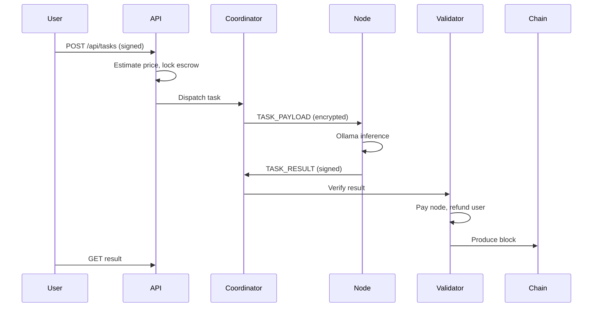

# Noetis Compute Architecture

## Overview

Noetis Compute is a **working federated prototype** of a decentralized AI compute network. It is **not fully decentralized** in this version: a central coordinator handles node discovery and task routing over WebSockets. The architecture is modular so the coordinator can later be replaced with libp2p peer discovery and distributed consensus.

## Layers

### 1. Blockchain & coordination layer

- **Application-specific blockchain** (`packages/blockchain`) — permissioned proof-of-authority validator produces blocks containing transactions and task settlement records.
- **NOET currency** (`packages/currency`) — test token with faucet, escrow, transfers, and stake architecture.
- **PostgreSQL** — persistent wallets, tasks, nodes, blocks.
- **Validator service** — verifies inference results, updates reputation, settles escrow, produces blocks.

### 2. Distributed AI compute layer

- **Coordinator** — WebSocket server for node registration, heartbeats, encrypted task delivery.
- **Node software** (`services/node`) — connects to coordinator, discovers Ollama models, processes prompts, returns signed results.
- **Scheduler** (`packages/scheduler`) — weighted node selection by reputation, availability, performance, price, latency.

## Task lifecycle

## Privacy model

- Prompts and full responses are **not stored on-chain** — only hashes, addresses, and settlement metadata.
- Task payloads are encrypted (libsodium-compatible box) between coordinator and node.
- **Important:** Ollama nodes must temporarily decrypt prompts to run inference. Prompt splitting alone does not guarantee privacy.

## Processing modes

| Mode | Description |
|------|-------------|
| `single` | Full prompt to one node |
| `redundant` | Same prompt to 2–3 nodes, compare results |
| `subtask` | Meaningful subtask decomposition for larger prompts |

## Future decentralization path

1. Replace coordinator with libp2p DHT for node discovery
2. Swap PoA validator set for delegated proof-of-stake
3. On-chain task commitments with off-chain data availability
4. True layer-by-layer distributed model inference (documented, not implemented)
